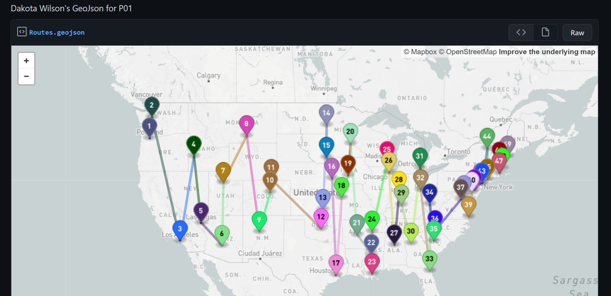

## P01
### Dakota Wilson
### Description:

Used a JSON file full of city data on the major citties of the United States to make a map marking all of the largest cities for each state and then making routes for going to them from west-most to east most.

### Files

|   #   | File                      | Description                                                 |
| :---: | ------------------------- | ----------------------------------------------------------- |
|   1   | Main.py                   | Main file that process all data and makes the GeoJson       |
|   2   | cities_latlon_w_pop.json  | File with data on all major cities                          |
|   3   | Routes.geojson            | File that is used to mark the map                           |
|   4   | GeoImage.jpg              | Images of final map made from GeoJson file                  |

### Instructions

- run main.py and watch the magic

- Example Command:
    - `python main.py`

### Link to GeoJson Gist: https://gist.github.com/DakTheProgrammer/ded481a0bbf6bed7ca3ab755e1f920b2

